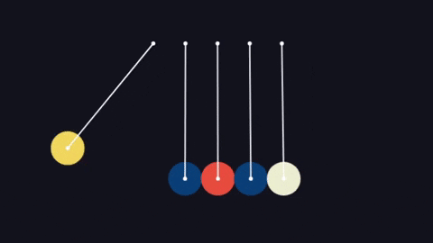

# 💡 Virtual Pysics Lab

Visualizing is the best, and most retainable way to learn something, thats what this project does. Its an awesome online tool to visualize physics in your own way!

## What's in the lab?

In the current times of the pandemic, where education is received online, I thought, why not contribute something to the education sector to help students learn and study by making their online learning experience better.

This project contains various physics stimulations where one can change some properties to see how bodies behave in their specified conditions. The properties include things like gravity, air friction, static friction, restitution, etc.

Its a responsive web application and hence runs good on both desktop and mobile devices.

## Built With

This project is built using the following technologies:

- [React.js](https://reactjs.org/) - Its the front-end library on which the project is structured.
- [Material-UI](https://material-ui.com/) - it is used to design the application and helps to make user experience better.
- [Matter.js](https://brm.io/matter-js/) - this library is the physics engine for the application. All the stimulations and the containing bodies made through this library.

## Usage

Just head over to the website or click [here](https://virtual-physics-lab.netlify.app/).
If you are using a mobile device and are uncomfortable with the interface try to switch to the desktop site on your mobile device.

<!-- CONTRIBUTING -->

## Contributing

Head over to [CONTRIBUTING.md](./CONTRIBUTING.md) to find information related to contributing to the project.

<!-- LICENSE -->

## License

Distributed under the MIT License. See `LICENSE` for more information.
